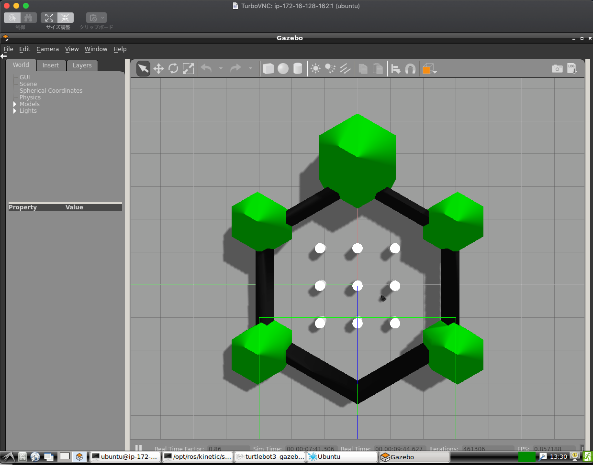

# ros-ec2-setup

List of 3 scripts to prepare a stock Ubuntu AMI on AWS to act as a remote workstation, including 3D
 acceleration (when used with a GPU instance). 

The scripts (located under `scripts/`) take care of installing Lubuntu, TurboVNC, VirtualGL, Nvidia
drivers.

## Installation

I've tested the scripts with a basic Ubuntu 16.04 image on a G2 instance. Also I tested a T3 instance, so it means you can choose if you use GPU acceleration or not.

The first step is to run the `install.sh` script:

`$ source install.sh`

The machine will reboot at the end of the process. You'll have to wait a bit and then reconnect to it.

Then, for a G2 instance:

**(You can skip this if you are NOT using G2 instances.)**

`$ source install-nvidia-drivers-g2.sh`

## Usage

Now you can just run the `startup.sh` script to initiate the X server and launch VNC on `PORT 5901`
(the first time, it will ask you to create a password for the VNC server).

If you reboot your instance, or if you decide to save a snapshot of your instance and use it as an
image for future instances, then all you need is to run `startup.sh` once the instance is up.

When connecting, I prefer to only open `PORT 22` on the instance, and create an SSH tunnel for VNC
like so:

`$ ssh -i permission_file.pem -L 5901:localhost:5901 ubuntu@ip_address`

Then I can use a VNC client to connect to `localhost:5901`.

You can also open `PORT 5901` on your instance and directly connect to it, but the connection won't
be encrypted...

Make sure to use a VNC client that supports VirtualGL (TigerVNC, TurboVNC, ...). Once you're in, you'll
have a full Lubuntu desktop with hardware acceleration!

If you wish to view your desktop in the browser, you need to uncomment the final line in the `startup.sh`
script to run a noVNC server and then create an SSH tunnel for `PORT 6080`:

`$ ssh -i permission_file.pem -L 6080:localhost:6080 ubuntu@ip_address`

You can access your desktop in the browser at `localhost:6080/vnc.html`.

To take advantage of VirtualGL, launch your 3D applications prepended by `vglrun`. For example:

`$ vglrun firefox`

And visit http://webglreport.com/ to check that you're effectively using the Nvidia hardware :-)

## Launch ROS applications!

For example, you can do something like:

`$ vglrun roslaunch turtlebot3_gazebo turtlebot3_world.launch`